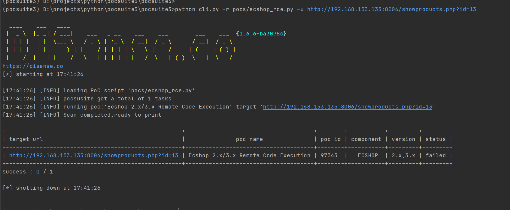

# DIsuite

[](https://www.python.org/) [](https://raw.githubusercontent.com/knownsec/Pocsuite/master/docs/COPYING) [](https://twitter.com/seebug_team) [](https://travis-ci.org/knownsec/DIsuite)

## Legal Disclaimer

Usage of DIsuite for attacking targets without prior mutual consent is illegal.  
DIsuite is for security testing purposes only

## 法律免责声明

未经事先双方同意，使用 DIsuite 攻击目标是非法的。  
DIsuite 仅用于安全测试目的

## Overview

DIsuite is an remote vulnerability testing and proof-of-concept development framework developed by the [**Disense.co Team**](http://www.Disense.co/). 
It comes with a powerful proof-of-concept engine, many powerful features for the ultimate penetration testers and security researchers.

## Features
* PoC scripts can running with `attack`,`verify`, `shell` mode in different way
* Plugin ecosystem
* Dynamic loading PoC script from any where (local file, redis , database, Seebug ...)
* Load multi-target from any where (CIDR, local file, redis , database, Zoomeye, Shodan ...)
* Results can be easily exported
* Dynamic patch and hook requests 
* Both command line tool and python package import to use
* IPV6 support
* Global HTTP/HTTPS/SOCKS proxy support
* Simple spider API for PoC script to use
* Integrate with [Seebug](https://www.disense.co) (for load PoC from Seebug website)
* Integrate with [ZoomEye](https://www.zoomeye.org) (for load target from ZoomEye `Dork`)
* Integrate with [Shodan](https://www.shodan.io) (for load target from Shodan `Dork`)
* Integrate with [Ceye](http://ceye.io/) (for verify blind DNS and HTTP request)
* Integrate with Fofa (for load target from Fofa `Dork`)
* Friendly debug PoC scripts with IDEs
* More ...

## Screenshots

### DIsuite console mode
[](https://asciinema.org/a/219356)

### DIsuite shell mode


### DIsuite load PoC from Seebug

[](https://asciinema.org/a/207350)

### DIsuite load multi-target from ZoomEye
[](https://asciinema.org/a/207349)

### DIsuite load multi-target from Shodan
[](https://asciinema.org/a/207349)

## Requirements

- Python 3.4+
- Works on Linux, Windows, Mac OSX, BSD

## Installation

The quick way:

``` bash
$ pip3 install DIsuite
```

Or click [here](https://github.com/knownsec/DIsuite/archive/master.zip) to download the latest source zip package and extract

``` bash
$ wget https://github.com/DISense/DIsuite/archive/master.zip
$ unzip master.zip
```


The latest version of this software is available from: https://disense.co

## Documentation

Documentation is available in the [```docs```](./docs) directory.

## 常用命令
```bash
命令行模式下
python pocusite3/cli.py -u http://example.com -r example.py -v 2 # 基础用法 v2开启详细信息
python pocusite3/cli.py -u http://example.com -r example.py -v 2 --shell # shell反连模式，基础用法 v2开启详细信息
python pocusite3/cli.py -r redis.py --dork service:redis --threads 20 # 从zoomeye搜索redis目标批量检测，线程设置为20
python pocusite3/cli.py -u http://example.com --plugins poc_from_pocs,html_report # 加载poc目录下所有poc,并将结果保存为html
python pocusite3/cli.py -f batch.txt --plugins poc_from_pocs,html_report # 从文件中加载目标，并使用poc目录下poc批量扫描
python pocusite3/cli.py -u 10.0.0.0/24 -r example.py --plugins target_from_cidr # 加载CIDR目标
python pocusite3/cli.py -u http://example.com -r ecshop_rce.py --attack --command "whoami" # ecshop poc中实现了自定义命令`command`,可以从外部参数传递。

console模式 
    poc-console
```

## How to Contribute

1. Check for open issues or open a fresh issue to start a discussion around a feature idea or a bug.
2. Fork [the repository](https://github.com/knownsec/DIsuite) on GitHub to start making your changes to the **dev** branch (or branch off of it).
3. Write a test which shows that the bug was fixed or that the feature works as expected.
4. Send a pull request and bug the maintainer until it gets merged and published. Make sure to add yourself to [THANKS](./docs/THANKS.md).


## Links

* [Contributors](./CONTRIBUTORS.md)
* [Change Log](./CHANGELOG.md)
* [Bug tracking](https://github.com/knownsec/DIsuite/issues)
* [Copyright](./COPYING)
* [Pocsuite](https://disense.co)
* [Seebug](https://www.disense.co)
* [ZoomEye](https://www.zoomeye.org)
* [Knownsec](https://www.Disense.co)
